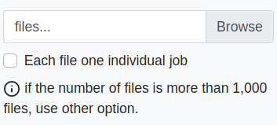
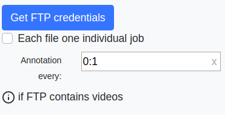

# Annotation Ecosystem

The annotation job manager is an ecosystem of application that allow to automatize all the pipeline annotation. The ecosystem are composed by:

* **Annotation job manager**: allow to motorize all the annotation workflow.

  

* **Annotation tool**: allow to the annotator annotate without any files management.

  

* **Backend system**: manage all the petitions like: create new jobs, manage current jobs, send image to annotate to annotators, compute metrics, etc... Is the core of the application and the **Annotation job manager** and **Annotation tool** require constant access.

## Information

#### Ecosystem

#### Dependences

- **MongoDB database**: to allocate information about jobs.
- **Persistent filesystem**: to allocate image, videos, etc.
- **External IP**: access to backend and frontend using IP or DNS.

#### Structure

- **annotation**: folder that contains the entire application for annotators.
- **backend**: folder that contains the entire backend server.
- **frontend**: folder that contains the frontend of the annotation job manager.

#### Assumptions

Each job is a batch of videos/images of a single match. 

All the images/videos are taken using static camera.

## How to deploy?

### Server

The annotation server runs on docker.

1. **Configuration**: Edit [docker-compose.yaml](./docker-compose.yaml)
    1. @14: Change "/media/corpus" for the path where you will be storing videos for annotations.
    2. @15: Change "/media/uploads" for the path where you will be storing the annotations.
    3. @28: Change "http://localhost:5000" for the URL of the backend server and port for running the server on a separate machine. (e.g. http://10.17.181.215:5000)
    3. The exposed port for the backend is 5000, you can change it if you want in lines: @13, @18, and also at the end of the VUE_APP_BACKEND_URL at the end of line @29.
    4. The exposed port for the frontend is 80, you can change at line @35.
2. **Build**: Run `docker-compose build` to build the docker 
image.
3. **Run**: Run `docker-compose up -d` to run the docker image in the background.
4. **Create Admin User**: Run `docker-compose exec backend python3 manage_users.py create --admin` to create an admin user.
5. **Create Regular User(s)**: Run `docker-compose exec backend python3 manage_users.py create` to create a regular user.
6. **Access**: Open a browser and go to the URL of the server (e.g. http://10.17.181.215:80)

### Client

The Annotation client application is an executable built and run on Windows.

1. Set current directoru to .\annotation
2. **Create Anaconda Environment**: Run `conda env create -name atv-annotation -f anaconda_requirements.yml` to create the environment.
3. **Activate Anaconda Environment**: Run `conda activate atv-annotation` to activate the environment.
4. **Configure default endpoints**: In case you want to predefine the server URL, you can edit the file [annotation/server_request.py](./annotation/server_request.py)@9 and change the variable 'ENDPOINTS' and add the URL(s) of the server(s) (e.g. http://10.17.181.215:5000).
5. **Build**: Open Anaconda PowerShell Prompt and run the builder powershell script: `.\build_tools\build_windows.ps1 path\to\atv-annotation\ path\to\anaconda3`
6. **Run**: Run the executable in the folder `path\to\output\ATV-Annotation-Client-\<Version\>\dist\labelImg\labelImg.exe`

### Global terms

#### Status

A job can have different status during the pipeline

- **FTP_UPLOADING**: this step only can reach using FTP. This step is necessary because the FTP does not know when the uploading is finished. For this reason the annotation pipeline has to start manually (using start FTP upload in annotation job manager).
- **PREPROCESS**: previous to be available for annotators. There is a full configurable step but actually contains:
  - Standardization of video, zip, files to .png images.
  - Autolabeling if the sport has DL model.
- **NOT_STARTED**: when the preprocess is done but there are not any annotation done in the job.
- **IN_PROCESS**: when the annotation process has been started.
- **POSTPROCESS**: when the annotation process is done, there is a similar step than *preprocess* but in this case normalize the output as the format that we want. Specifically:
  - Output generation create an output folder with the name/camera that contains: image, xml and roi.json.
- **FINISHED**: the job is done.

This is not a status (is complementary), but in some step the job can be canceled (wrong files, crash during autolabel, codec video, ...) and in the annotation job manager will show a **CANCEL** status for this job.

#### Tags and Frame Tags

The tags or job tags define tags for all the Job.

In contrast frame tags are exclusively for each annotated image.

Tags can be generic for all the sports or specific for a one sport.

#### Annotation order

The annotation order that we send to annotators is defined by: first **priority**, second **creation date**.

#### Annotation folder

The folder that contains all annotation data can be found in `core/config.py` in **BASE_UPLOADS** variable. 

Depends of the status of the job there are the following folders:

- **tmp**: temporal data for not finished uploads (for browser uploads). Every job has a folder generated by unique uuid.
- **ftp**: temporal data for not finished FTP uploads. Every job has a folder generated by unique uuid.
- **input**: data for not finished jobs. Every job has a folder generated by unique uuid.
- **output**: data for finished jobs. Every job has a folder generated by name/camera.

### New job

This area of the annotation job manager allow to create new jobs using different kinds of type files.

1. **Job name**: The name of the job, have to be descriptive and is better allow spaces. For instance: Football_NY_20_12_2023.

2. **Camera**: The camera position of the video.

3. **Files**: Is the most important area of the new job. Allow to upload files into the jobs, actually exists five types of uploading:
   a. **Files**:
   Allow to upload images using directly the browser, that is useful to send to annotate small batches.
   
   
   
   **Each file one individual job** refers to create a single job for each file. Is useful when images are not related each others.
   
   b. **Video**:
   Similar than files selector, allow to upload a *single video.*
   
   
   
   When the video is selected another fields appear:
   
   
   
   This information are related about the video that we want to upload, is very important fill this information correctly. **Start delay** refers the starting time that the video is interesting to annotate, **end time** refers the time of the video that we want to finish the annotation and **annotation every** selects how many seconds we want to annotate.
   
   c. **Zip**:
   Allow to upload multiple files using a zip. The files in zip can be inside to folder, the system will unzip and later will flattened all the folders inside (/directory/image.png -> directory_image.png).
   If the zip contains video we need to select **annotation every**.
   
   
   
   
   d. **FTP**:
   Slightly different than the previous methods. This configuration allow to create a FTP credentials to upload massively files into a job. 
   
   
   
   When you press the Get FTP credentials you will get something similar than this:
   
   
   
   This configuration allow you to use your favorite **FTP client** to upload files, like this:
   
   
   If you create a job using this option, this job will not detect when the upload is finished. You have to start manually:
   
   
   
   
   e. **CORPUS**:
Also you can use a CORPUS path in the server (where unanotated data is stored), in this case you have to use glob route. Glob is a common method to select files easily ([glob info](https://docs.python.org/2/library/glob.html)). 
   Is very important that the route has to be relative with respect the corpus folder and in linux format. The reason is that in every computer the absolute route can be different.
   
   

4. **File ordering**: 
   File ordering is also important because is the order that the annotator will receive the images. And is important to preserve to make consistent some metrics (like timeline frame tags).
   There are five methods to order:
   a. **ASCEND BY MOD. DATE**: Use the modification date of the file to order in ascending mode.
   b. **DESCEND BY MOD. DATE**: Use the modification date of the file to order in descending mode.
   c. **ASCEND BY NAME**: Use the name of the file to order in ascending mode. Remember if your file have number, must be padded by 0 or use REGEX.
   d. **DESCEND BY NAME**: Use the name of the file to order in descending mode. Remember if your file have number, must be padded by 0 or use REGEX.
   e. **CUSTOM (regex by name)**: It is seems complex but don't be afraid. It's very easy to use. This ordering allow to order using hierarchical ordering. If you remember SQL is similar than ORDER BY field_1, field_2. The priority is to order first by field_1 and secondly by field_2.
   
   The complexity of *RegEx* is simplified by the following expression: {type_field|type_order|index_order}, this expression allow you to order files like: {string:asc:0}_{number:desc:1}.jpg -> hola_1.jpg, adeu_2.jpg.
   
   - **type_field**: represents the nature of the data that we want to order: string, number, float.
   - **type_order**: is optional (ascending by default) and represent the order: asc or desc.
   - **index_order**: represents which is the priority in the ordering, 0 -> first to order, 1 -> second to order, ...
   
   **Example:**
   
   Suppose that we have this files: [a_1.jpg, b_3.jpg, b_2.jpg]. We want to order the letter as descending and the number ascending. The expression will be {string:desc:0}_{number:asc:1}.jpg.
   
   1. First we order the letter as desceding: [b_3.jpg, b_2.jpg, a_1.jpg].
   2. Second we order the number as ascending:  [b_2.jpg, b_3.jpg, a_1.jpg].

5. **Priority**: The priority of the job. More high value more priority.

6. **Sport**: The sport of the job. Is also important because in the preprocess step the backend will try to annotate using the actual DL model of these sport. If this sport don't have autolabeling model a notification will be show.

7. **Job tags**: Job tags will define some useful tags for this job.

8. **Frame tags**: In this case we will define the default frame tags that the annotator will have selected in the annotation tool. The annotation tool have access to all frame tags of this sport, this field only select someones by default to reduce annotation time (imagine that the annotator have to select all the tags for each image... Now only have to enable/disable the non-default).

9. **Comments**: Additional comments about the job.

### List jobs

Is the core to monitor jobs. First you will see an list of all the jobs that the system have:

1. **Filter by status**: allow to filter the list by an specific status.
2. **Refresh**: refresh the list.
3. **Content**: show the list with the most relevant information:
   - Name and camera.
   - Priority.
   - Current status.
   - Creation date.
   - Author.
   - Is valid? There are some crashes?
   - Show full information.
   - Metrics of this job (only if the status of the job is in process or more).
4. Pagination of the list.

#### Show details

Show all the information of the job. 

1. **Status historic**: we can find status historic that show the timestamps of every step of the pipeline. Also including in the *preprocess* and *postprocess* which step.

2. **Trace**: and the trace show in which percentage of each step are actually the job.

3. **Visibility**: enable/Disable the visibility of the job, this allow to hide in certain moment this job for the annotators.

4. **Generic tags**: allow to change some tags for the job.

5. **Frame tags**: allow to change the default frame tags.

6. **Remove**: there are two kinds of remove: *Remove job* remove the job and the files if the job is not finished. If the job is finished *Remove Job* will not remove the files,  there is an additional to do that:

   
   
   Also if the job was uploaded using *Each file one individual job*, will be appear two additional buttons to remove this job and his brother jobs.

### User manager

The user manager area allow to create users and manage the current ones. There are only two groups: *ADMIN* (entire access) and *ANNOTATOR* (only access to annotation tool). 

Also show if the user are currently active in the annotation tool.

Actually in show details can only change the user password or disable the user (not remove).

### Main Configuration

The main configuration area allow to create/remove new sports or new tags.

 If the select one sport we can create tags or frame tags for this specific job.

### Metrics

Metrics is not an area, is a full page for this purpose. Allow to obtain a lot of information about specific job: timmings of annotators, distribution of labels, spatial information of labels, ROI position of the field, time distribution of frame tags, etc...

1. **Timmings**: timmings area show the elapsed time to annotate all the job or the mean for each image. Also you can obtain this metric for each annotator.
2. **Class distribution**: class distribution is very useful to understand the distribution of this job. 
3. **Heatmap**: heatmap area have a lot of spatial information of the job. We can know in which areas of the image are more distribution of annotation (in general or for each class). Also we can see the ROI of the field and change the frame that actually are viewing.
4. **Timeline activated frame tags**: If the frame tags are correctly used and the video is correctly order, we can see at which approximate time of the job every frame tag are enabled or disabled. Is useful for example to find some parts of the video that have a relevant frame tag. Note: There is currently no way to display a timeline per frame. So you have to convert frames in time.
5. **Distribution frame tags**: Similar than class distribution, show the distribution of the frame tags.

## Annotation tool

Annotation tool is practically the same than the previous one. In contrast when we start the annotation tool, this dialog will appear:

This dialog allow to:

- Use the **New** labeling with user/password.
- Use the **Old** labeling.

When the login is done, we can **Start** the labeling process (this dialog is important because allow to the system to know what labelers are connected and which to send images):

The first frame in a job is also necessary label the ROI of the field:

Once labeled, will no be necessary to label for the rest of the job.

When the roi is labeled, the application is very similar than the previous versions, but with these differences:

1. **Finish**: Allow to finish/pause the labeling process.
2. **Information about the label**:
   * **Sport**.
   * **Camera**.
   * **Frame tags**: *Very important*, the annotator can change and enable/disable the frame tags depends of the image frame.
3. **No edit**: When are not changes in the label image, by default you can not go to the next one. If you are sure that the current image is well annotated without any changes, you can push *No edit* button.